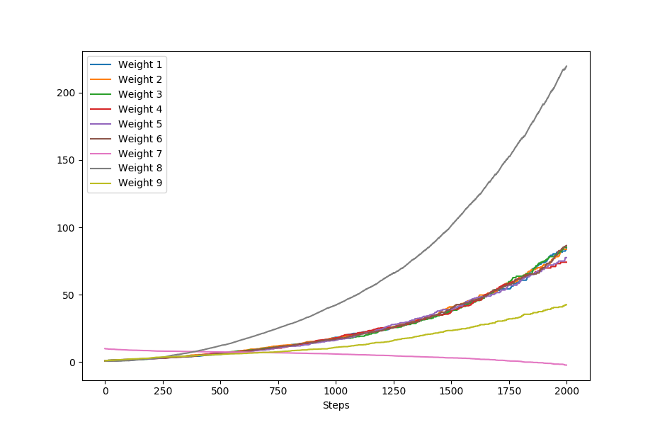

# Exercise 11.3: Divergence in Semi-Gradient Q-Learning

In this exercise we provide empirical proof that Q-learning also diverges in Baird’s counter-example environment. In order to adapt the example from the book to Q-learning, unique feature vectors needed to be constructed for each state-action pair instead of just for every state. This was easily done by adding a ninth feature to the existing feature vectors that carried the value of 0 when the dotted line action was taken and a value of 1 for the solid line action. A ninth weight was also added to the weight vector to accommodate the extra feature. Otherwise all parameters were kept identical to the values provided in the book, including the behavior policy. 

The weights all diverged in much the same manner as in figure 11.2 in the book. The ninth weight added for the action feature also diverged, although not as fast as the others. It is interesting to note that although not clear from figure 11.2, weight 7 diverges downward towards negative infinity. This becomes more apparent when graphed over more steps. As long as all weights are initialized to be greater than zero they seem to always diverge, although the initial weights provided by the book diverge faster than most other initializations.
