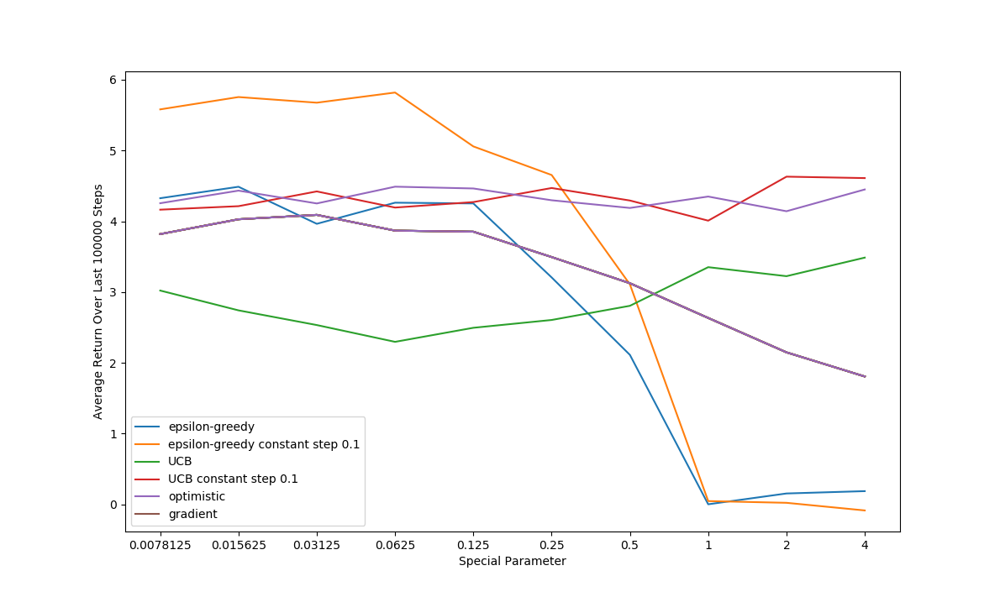

# Exercise 2.11: Nonstationary Full Algo Parameter Study

	This exercise serves as a summary of all the algorithms presented in section 2, all compared in the nonstationary ten-armed test bed from exercise 2.5. All four algorithms used in figure 2.6 are required, as well as a version of epsilon-greedy that uses a constant step-size alpha instead of simple averaging. Since these algorithms are mostly the same with only minor differences, all 5 were put in the same class with the ability to switch between them by specifying the “type” during initialization. The ability to change the learning rate from a simple average (alpha = 0) to a constant step-size alpha (alpha > 0) was left as a separate parameter from the type system so that any of the other algorithms could also be tried with both types of step-size, although only UCB ended up being tried with both (gradient uses its own alpha and simple average step size for optimistic would get rid of optimistic values too fast). 

	The six different algorithms were each run for all of the parameters shown in figure 2.6. Unlike figure 2.6, however, algorithms in this exercise were each run for 200,000 steps instead of 1,000. Additionally only the average reward over the second half of the run was used. This makes a very big difference in a nonstationary environment since it allows the reward distributions to diverge far from their initial values, really testing the algorithms ability to adapt to changes in the environment. This also introduces much higher variance in performance (much bigger difference between rewards after they have been changing for 100,000 steps). To achieve a (somewhat) smooth result the average performance for each parameter was averaged over 100 runs. The final graph is below:

	In the nonstationary environment it is no surprise that the best-performing three methods all use constant step-size as opposed to a simple average approach. A constant step-size allows the algorithm to retain the same ability to learn from changes in the environment no matter how long it has been running. Simple average approaches, however, learn less and less as time goes on, making them ill-suited for nonstationary environments (as shown before in exercise 2.5). More interesting perhaps is UCB’s poor performance relative to epsilon-greedy, especially when it was the clear winner in figure 2.6. This is because the term N_t in the denominator of UCB’s action selection formula decreases exploration of an action the more it has tried it. After 100,000 steps UCB has tried all the actions quite a few times, and as a result it has massively decreased exploration and adaptation. 

	The gradient method actually seems to have performed the worst in this example. This is puzzling at first but makes sense after looking at figure 2.5. Figure 2.5 shows that gradient methods do poorly when they don’t have a baseline. While the gradient algorithm in this exercise is implemented with a baseline, after 100,000 steps it lags behind the true average reward. Similar to the simple average methods it adapts slower and slower as time moves on, despite the true reward distributions changing as much as ever. As a result the gradient algorithm is getting an inaccurate baseline and consequently suffering from some of the same performance issues as in figure 2.5.

	The last noticeable feature of the graph is the massive decrease in performance of the two epsilon-greedy algorithms as they approach one. They seem to settle at about 0 average reward. This is because their special parameter is epsilon, and when epsilon is >= 1 the algorithm acts completely randomly, achieving the mean reward of the entire distribution which should remain at about 0. Taking this into account it seems that epsilon-greedy constant step-size is clearly the best algorithm in this environment. This experiment along with the results of figure 2.6 illustrates that the best bandit algorithm depends greatly on the degree of stationarity of the environment.
