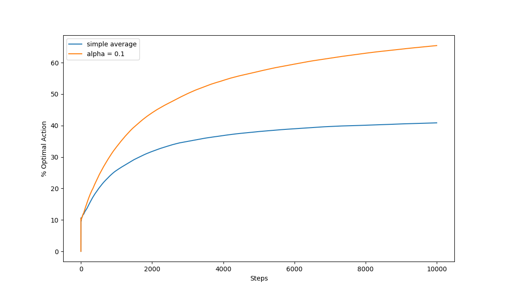
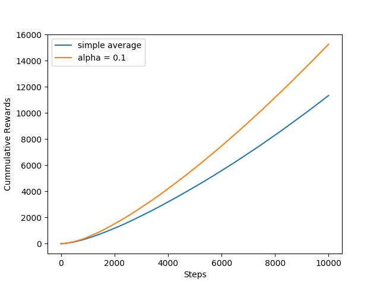

# Exercise 2.5: Nonstationary Bandit Comparison

This exercise is a comparison between Q agents using two different update methods in a nonstationary bandit environment. One agent uses a simple average to update its Q values while the other uses an exponential average with learning rate alpha. The experiment was repeated 2000 times as done in figure 2.2. Optimal action selection rates over ten thousand steps are pictured below.

It can be seen that an exponential average update technique does far better in a non stationary environment. This is easy to understand if you think of the incremental average update instead as a decaying alpha, inversely related to time steps. From this point of view it can be seen that the simple average agent learns slower and slower, highly resistant to new information about the values of actions. The law of large numbers makes this a great strategy in stationary environments, but in a changing environment this behavior means that the agent will continue to take the same suboptimal action even after experiencing better actions several times. This stagnation in action selection can be easily seen in the slope of the total rewards over time graph:

The slope of the simple average agent’s returns stagnates while the exponential average agent is able to find the new better actions and increase the rate at which it acquires rewards. 
