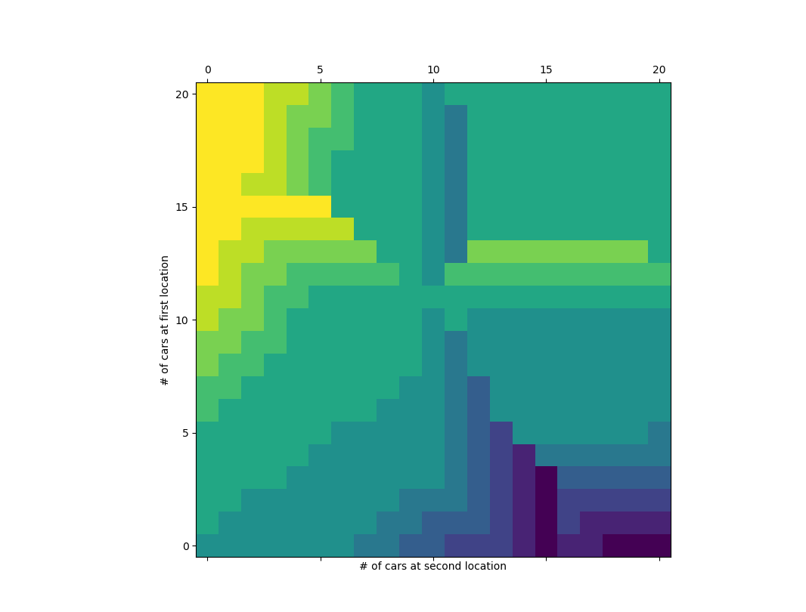

# Exercise 4.7: Policy Iteration Implementation

This exercise implements policy iteration to resolve Jack’s car rental problem posed in example 4.2 with additional rules. The code was written to be easy to understand and in the same structure as presented in the box on page 80. This code takes a long time to run due to the large number of possible transitions from each state. In order to improve run time the function get_action_q(s, a, value) does not account for transitions that have an extremely low probability of happening. Doing so provides a very large speed-up for a negligible loss in algorithm accuracy. Run time can also be improved by increasing theta, although this comes at the expense of the optimality of the final policy. Likewise, theta can be decreased for a longer run time and a closer-to-optimal final policy. The heatmap depicting the final policy is shown below:

The irregularities introduced by the added rules can be easily seen in the heatmap. The flat $4 charge rate for > 10 cars creates several sudden upticks in cars moved along the 10 car lines in both dimensions. Meanwhile the first free car move to the second location essentially shifts the policy towards moving more to the second location in all states, since these moves now all cost less. Overall dynamic programming proves itself adept at handling arbitrary rules, showing off the robustness of the algorithm. The heavy computational cost does however remain a problem, making dynamic programming infeasible for larger problems.
