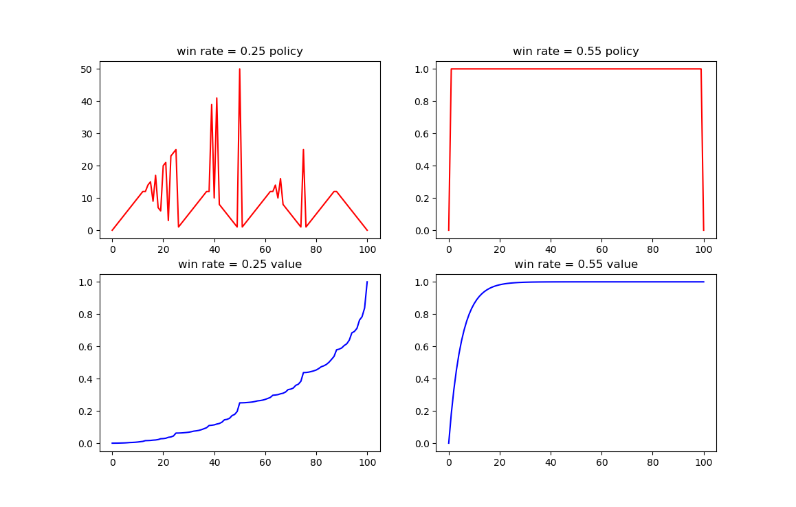

# Exercise 4.9: Value Iteration Implementation

	This exercise implements a special case of policy iteration called value iteration in a simple gambling environment. Value iteration skips the policy improvement phase, instead just always assuming greedy policy with respect to the current value function. In this way it is generally able to do quicker sweeps, but, as a consequence, usually needs more sweeps to converge to a satisfactory policy. In this case we were told to use value iteration to solve for win probabilities of 0.25 and 0.55. The value functions and corresponding greedy policies are shown below:

	For the 0.25 policy there seems to be noise interfering with the found optimal values, which could be a result of theta being too high, but even at theta = 0 the noise persists (meaning it persists beyond the level of a precision in a python float). Regardless of why the noise is there, the real policy can be easily seen (running at different thetas changes where the noise is and makes it even more obvious). 

	It can be helpful to better understand and appreciate the algorithm to understand why the optimal policy is what it is. Intuitively the agent in this environment can be understood as either avoiding convergence to its win rate or optimizing to encourage it. When the win rate is 0.55, the agent wins more than it loses, and as a consequence it will eventually win if it does not hit 0.  Therefore its optimal policy is to always bet the minimum, $1, in an effort to stay alive as long as possible to give its average win rate the maximum chance to converge to a winning one.  On the other hand, win rates under 0.5 like the 0.25 case force the agent to try to get to the terminal winning state as fast as possible, before its average win rate converges to a losing one. As a consequence it builds its strategy around getting to states where it can bet it all without any wasted money, leading to local maximums in value around "bet it all" spots.
