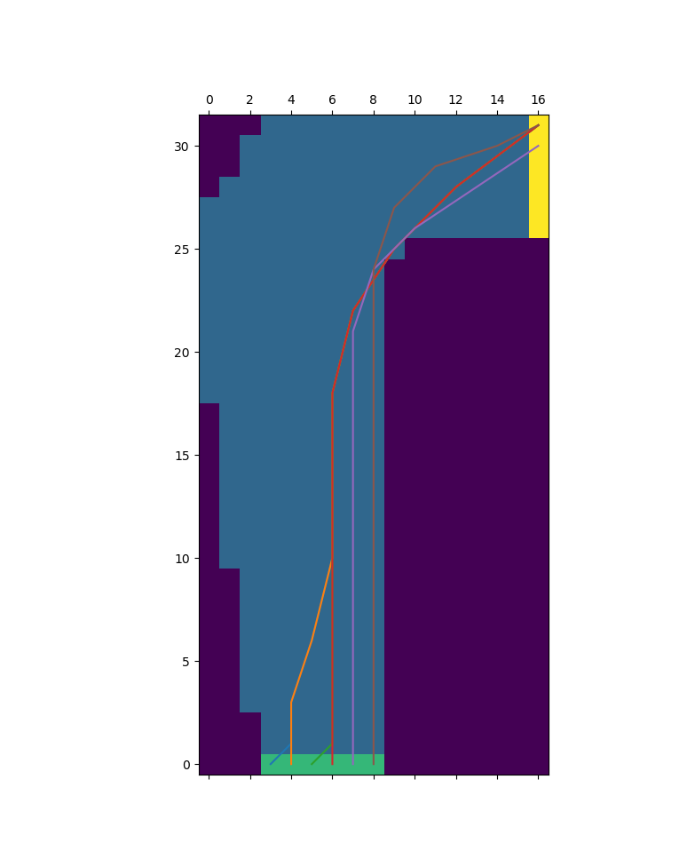

# Exercise 5.12: Monte Carlo Control

	This exercise is an implementation of monte-carlo control in an undiscounted racetrack turn environment. Additionally, noise was added in the form of a 10 percent chance of the agent’s action being ignored. This makes the problem much harder to solve since it adds in randomness to an otherwise deterministic environment, and ultimately forces the agent to be more cautious, avoiding states near the edge where not being able to slow down would be catastrophic.

	Monte Carlo methods are offline, which means they will not learn until the episode ends. In this environment the only way to end an episode is to get to the goal - failure sends you to the starting line without termination. With a random initial policy this proves to be a big problem: you have to either get extremely lucky with an initial policy that makes it to the finish, or, more likely, you have to wait for epsilon to randomly pick actions that get you to the finish line. Initializing your action-value function optimistically makes this problem insurmountable, since your agent will want to try all the states and will eventually get stuck going to the same terrible state, far from the finish. This is important because with this reward function initializing Q = 0 for all state-action pairs actually is optimistic: in reality you will always have negative returns in this environment since the only rewards are negative. Thus the real values of Q are negative for all state-action pairs. To remedy this, Q was set to -1000 for all state-action pairs, making the only exploration the agent does due to epsilon and fixing its insistence on visiting terrible states repeatedly. Even without the optimistic initialization sometimes the agent still gets unlucky and has a hard time finding the finish for the first time. In these cases it is usually best to just restart the program.

	The other major problem I ran into was the agent’s inability to learn the rightmost starting position. From this position any acceleration in the x causes the agent to crash. Instead of trying to learn the policy from that position, the agent chose to crash immediately to respawn in another starting position. This problem was easily fixed by making the agent respawn in the same position it spawned in originally, but it serves as a prime example of agent environment-hacking, taking advantage of environment mechanics in unforeseen ways.

	To run the actual experiment the behavior policy was epsilon-greedy (epsilon = 0.2) with respect to the target policy, which was greedy with respect to Q. The first track presented in the book was used. The agent was allowed to learn for 5,000,000 episodes in order to ensure convergence, after which the trajectory from each starting position was plotted according to the greedy policy (the noise was also removed for the final plotting). The final result can be seen below:

	It can be seen that the agent was able to learn effective policies from all three starting positions. Interestingly it does not look like the agent took full advantage of the leftmost starting positions, choosing to join up with its other trajectories instead of swinging around the bend wider. This may be because the wider swings would require more precision, bringing the agent closer to the edge and increasing the chance that the noise would cause the agent to crash.This problem does a good job highlighting some of monte-carlo’s strengths and weaknesses, which will be touched on more in later chapters.
