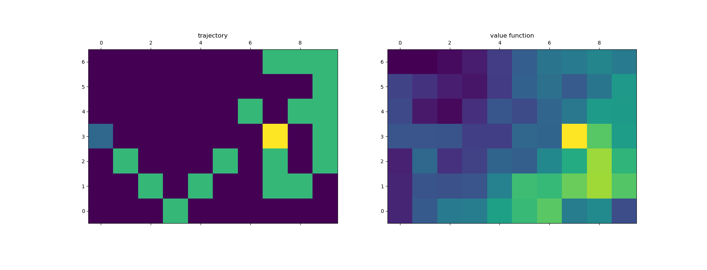
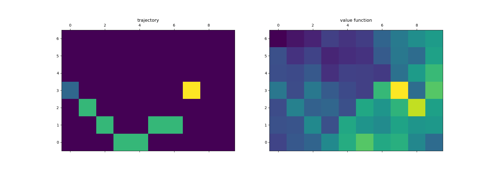
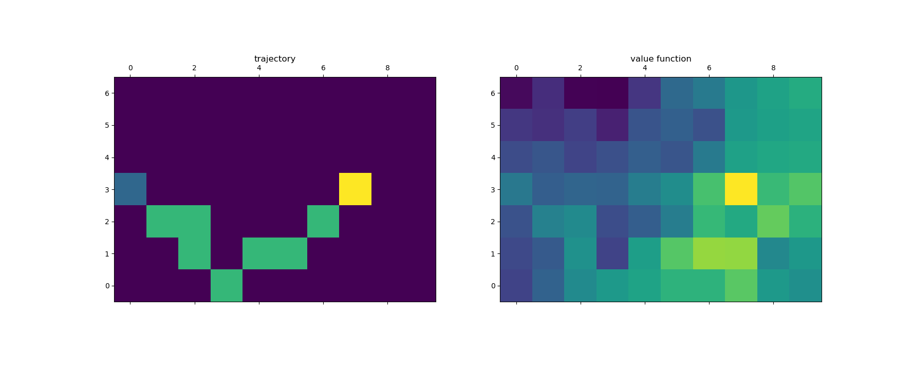

# Exercise 6.10: Stochastic Temproal Difference Control

	Exercise 6.10 is just a stochastic version of exercise 6.9. As such much of the code was reused, and everything stated in exercise 6.9 still applies. Only king’s moves were tested as stated in the exercise description. While the code in this exercise is only slightly different, the noise of the new environment makes the problem far harder. So much harder in fact that even after 10 times as many episodes (and a more slowly decaying epsilon) the agent often overshoots the goal and needs to take far more moves than the minimum of 7 established in exercise 6.9. An example of such results are below:

	Such behavior seems bad but is expected even in an optimal policy in such a stochastic environment, as the agent simply does not have enough control over its movement to optimally traverse to the goal every time. Solutions matching the absolute best case established in exercise 6.9 are also common:

	More concerning are examples where the agent takes an inefficient route even before it reaches the stochastic wind. An example of this outcome is below:

	In this example the agent has greedily chosen to make both a horizontal and a vertical move when it could have just taken a diagonal. This is the type of inefficiency that TD control should be able to correct for, so it is unclear why it still persists even after so much training. It seems like the uncertainty caused by the stochastic wind affects learning even outside of its area of influence. These mistakes could most likely be eliminated by better tuned hyper-parameters, perhaps a lower/decreasing alpha or more episodes. Overall TD-control performs admirably in this environment, providing a decent policy despite the unpredictability of its environment.
