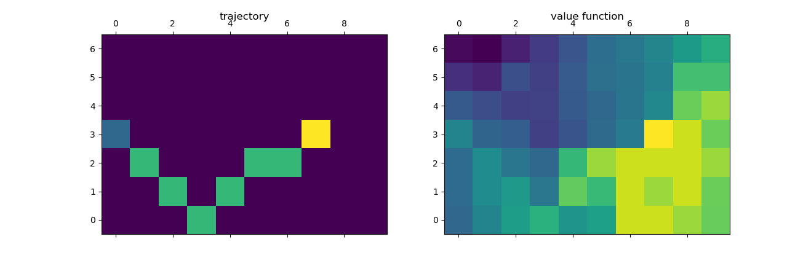
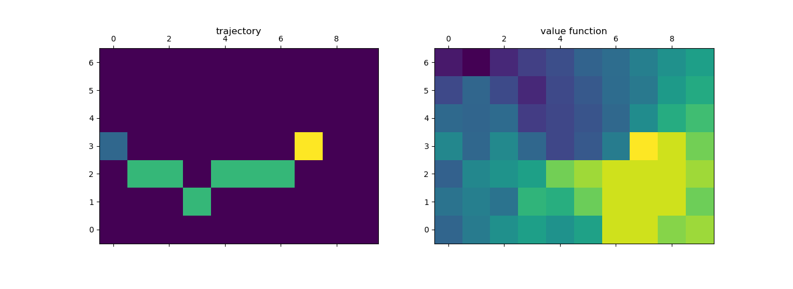

# Exercise 6.9: Temporal Difference Control

This exercise recreates the windy gridworld sarsa experiment from example 6.5 with two larger move-sets. The question is whether or not these move-sets allow better solutions. Even before the experiment is implemented it is apparent that a much better solution can be reached with king's moves. A diagonal move is basically two moves in one, allowing both a horizontal and vertical move. In a basic approach the vertical component can simply be used to negate the wind while the agent moves towards the goal.

In practice the agent with king's moves actually had some trouble converging to an optimal policy. Even after running for a large number of episodes it would quite often take a sub-optimal path when run greedily. This instability seemed to be caused by too high of an epsilon. The random moves were adding too much noise to allow an accurate calculation of the Q function. This was corrected by decreasing epsilon slowly over time. To achieve this slow decrease, epsilon was multiplied by an epsilon_decay variable very close to one at each time step. By gradually moving towards the greedy policy reliably stable convergence to an optimal policy was achieved. Both the greedy trajectory and the value function (max(Q) for each state) after learning for 1,000,000 episodes are shown below:

As predicted the agent learns to reach the goal in the same number of moves as the distance to the goal (7 moves instead of the original 15). This is the best possible result without allowing the agent to move more than 1 block per time step. Since the second part of the question does not add any such action (only adds no action), it will not be able to find a better policy. Its corresponding greedy trajectory and corresponding value function can be seen below:

Once again the greedy policy found an optimal policy. Both move-sets find different optimal policies depending on the random seed they are given. The only real significant difference between their resulting value functions is at square (1, 7). The difference results from the fact that the not moving algorithm can reach the goal in one action at this spot while the algorithm limited to king's moves needs two moves to reach the goal. So while adding the no move action does allow slightly more freedom it ultimately does not produce a better greedy policy.
