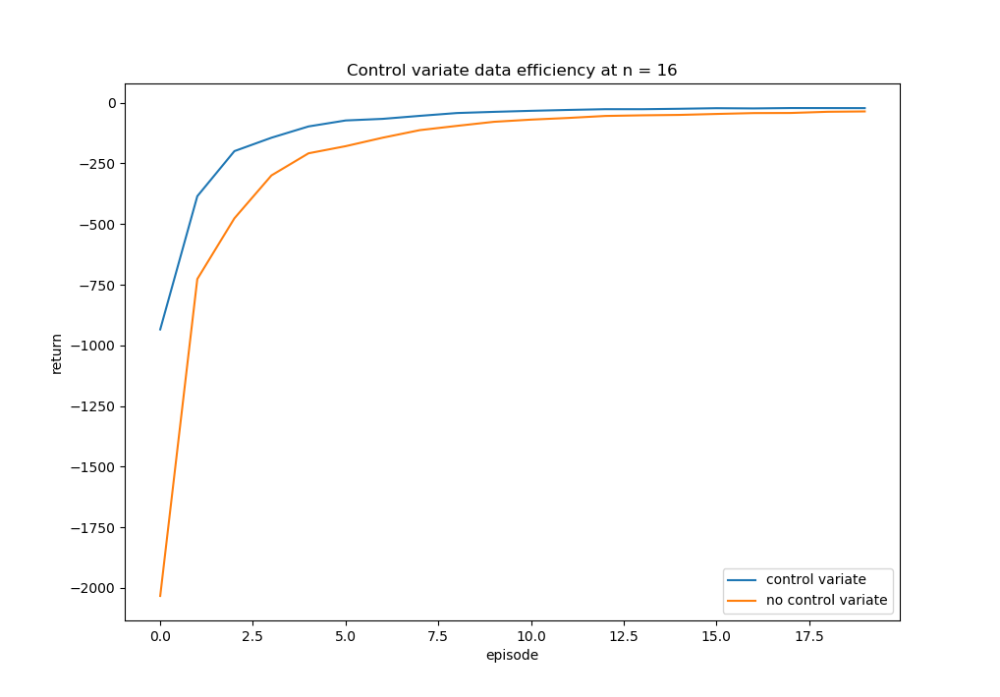

# Exercise 7.10: Control Variate Data Efficiency Demonstration

	This experiment shows the increased data-efficiency that can be achieved by using a control variate in off-policy learning. The windy gridworld environment was reused from example 6.5, with an epsilon-greedy behavior policy and greedy target policy. With this combination of behavior and target policies the control variate method has two benefits that arise from not having an (ALPHA * RHO) term in its update equation. The first is that it does not have a fluctuating learning rate that can go over 1 (causing instability), and the second is that its learning rate is never set to 0 (discarding the rest of the experience). Since this experiment is meant to test data efficiency equation 7.9’s (ALPHA * RHO) term was capped at one in order to get stable results (when (ALPHA * RHO) > 1 repeatedly it causes the same problems as an alpha > 1).

	The control variate data-efficiency advantage will be larger when higher value n-bootstrapping is done (more time to take off-policy actions), or when epsilon is bigger (off-policy moves taken more often). In both cases the no control variate method is forced to throw out experience that the control variate is able to still use. Even at a relatively low epsilon of 0.1  and n = 16 bootstrapping the control variate update method is much more data efficient. The comparison of the two’s performance over the first 20 episodes can be seen below.

	The difference is most drastic on the first episode, where the control variate method is able to quickly learn and correct its random starting policy while the method without the control variate takes much longer since it is not learning from a lot of its experience. This disparity continues, and even after 20 episodes there remains a significant gap in performance. Higher values of n or epsilon will increase the advantage of having a control variate even more, especially initially where the no control variate method repeatedly makes the same mistakes. 

	All of this is also without the instability induced when equation 7.9 has an (ALPHA * RHO) > 1, which a control variate also corrects for. Using a control variate seems to have many advantages with little to no drawbacks, making it the clear choice in the majority of cases.
