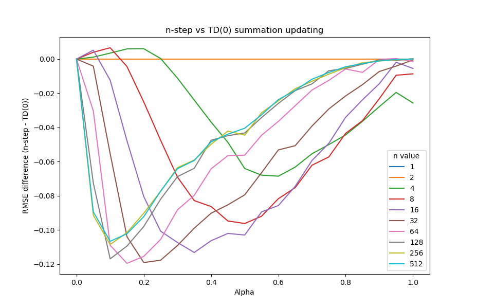

# Exercise 7.2: Comparison Between n-step Error and TD Error Summation

	A big focus in the book is writing errors as a summation of TD errors. In this exercise we explore what happens empirically when you do this. Because TD errors do not account for updated values, visiting the same state twice within n time steps leads to that state being updated again without taking into account its prior update. This essentially increases the learning rate beyond what it was supposed to be and, like high learning rates, leads to instability. Without intervention, even moderate learning rates and or n values lead to an explosion of the value function, leading to unreasonably high error. In order to get a reasonable comparison, value functions were restricted to never value a state more than the environment's max/min return. This allows the difference between n-step updating and TD(0) summation updating to be compared across the full spectrum of n values and learning rates shown in figure 7.2. The resulting difference in RMSE between the two methods can be seen below:

	Right off the bat it is easy to see that the summation of TD-errors proves detrimental to the algorithm in all but a few cases. Firstly it can be seen that there is no difference in error between the n = 1 and the n = 2 cases. The n = 1 case is trivial since in this case the two errors actually are equivalent. The n = 2 case is slightly more nuanced and requires an understanding of when the summation of TD errors fail. 

	Like it has been said before, the summation of TD errors only ends up being different when the value function changes within the space of n, and, in order for the value function to change the state must have been visited. Thus, in order for the summation of TD-errors to be different, a state must be visited twice within the space of n: once to be updated accurately and then a second time to be updated erroneously using the value from before the first update. Now it can be seen why there is no difference with an n of 2; there can not be two duplicate states when there are only two states in the trajectory and you can’t transition to the same state. In this problem an n of 3 or bigger is needed in order to have duplicate states and consequently have the summation of TD errors be different.

	Now we should address the small parts of the curve in the upper left where TD summation actually produces a lower error rate. In this area with super low alpha the increase in “learning rate” caused by TD summation actually helps the algorithm learn faster. This is a clear sign that these alphas are too low for their respective n-values. It should also be noted that the window for this benefit gets smaller and smaller as you increase n. This is because at increased n the updating from the same value multiple times gets more and more extreme. At a certain point the instability is far too much to be helpful anymore, even at very low alpha. It is this same instability that causes TD error summation to be so far inferior in the rest of the graph.

	The last thing to notice is the bottoming out of the curves and the slow increase back to no difference between the methods. This is purely an artifact of the restriction on the value function to be between 1 and -1. As stated earlier once the value function escapes this bound it begins exploding toward a value of infinity for all states, and consequently the RMSE would also tend toward infinity. The bound does not allow this to happen, instead capping the inaccuracy of the TD summation. The upward slope is then produced by the RMSE of the n-step error going up while the TD error summation stays constant, more or less meeting at alpha = 1, where neither one is able to make good updates

	The shortcomings of summing TD errors in place of another longer timeframe error is made clear by this graph. Even in situations where this happens to produce slightly better results, it would be much better to simply increase learning rate. Summing TD errors is also more computationally and memory intensive. In most cases it should be avoided as much as possible.
