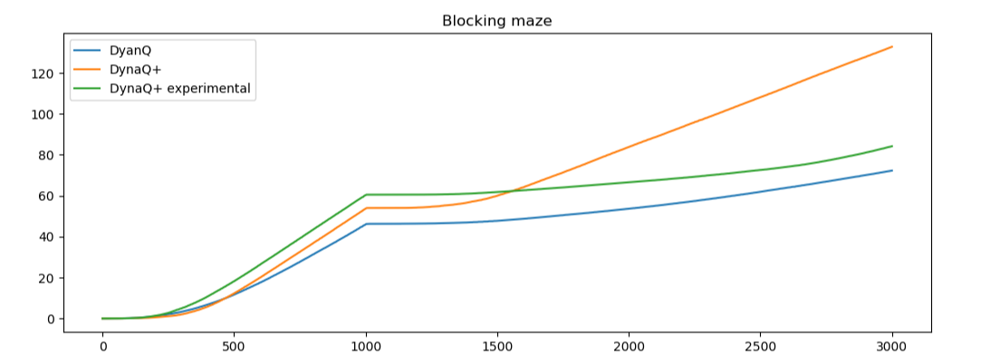
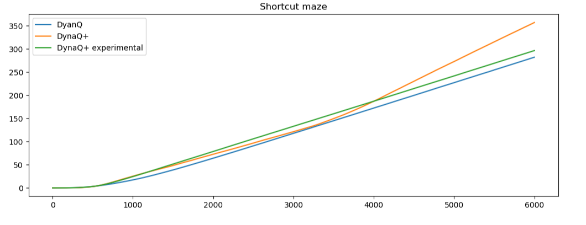

# Exercise 8.4: Comparison of DynaQ Planning Methods

	This implementation provides a comparison between three different planning agents: Dyna-Q, Dyna-Q+, and a modified experimental Dyna-Q+. The experimental Dyna-Q+ takes into account time elapsed since an action was taken only when deciding on an action, in contrast to the original Dyna-Q+ that takes this into account in its planning. In this way the experimental Dyna-Q+ agent can be thought of as a less aggressive  Dyna-Q+, exploring moves close to its greedy policy but not actively seeking out new things to try. In order to adequately compare the three methods both the blocking maze (Ex. 8.2) and the shortcut maze (Ex. 8.3) proposed by Sutton and Barto were used. The blocking maze tests the agent's ability to revise its policy when forced, while the shortcut maze tests the agent's ability to find an improvement that does not disrupt the current best policy. The latter task requires much more aggressive exploration, since the new optimal route is far from the established greedy policy.

	All three agent's were first tested with the original hyper-parameters detailed in exercise 8.1, but it was immediately apparent that a bigger alpha was needed for Dyna-Q+ to work properly. With an alpha of 0.1, the Dyna-Q+ agent’s Q values stayed inflated by exploration value even after they were recently visited. This leads to over-exploration and consequently underperformance as the agent fails to exploit the optimal strategy. The experimental Dyna-Q+ did not suffer from the same problem because its method of exploration is short-sighted, and thus does not involve alpha. This is one strength the other two agents have over Dyna-Q+: they are much more flexible to learning rate, and thus may be preferable in environments where high learning rates cause unstable agents. The extreme case of alpha = 1 seems to provide decent performance for all three agents, so it was used in the final comparison, although other high values of alpha were comparable.

	Next a suitable value for kappa had to be found. No guidelines were given in the book (other than it being small), so this was done through trial and error. Intuitively, increasing kappa can be understood to encourage exploration, while decreasing kappa discourages it. The Dyna-Q+ agent seemed to be much more sensitive to kappa, with drastic underperformance at high values and complete reversion to Dyna-Q’s performance at low values. The experimental Dyna-Q+ had much lower variance, although it likewise underperformed at high values and reverted to Dyna-Q at low values. Although it seemed the experimental Dyna-Q+ would have benefited from a higher kappa than Dyna-Q+, a constant kappa of 0.002 was settled on for both for an equal comparison. The planning n-value did not seem to have a very big effect on results within a certain range, so n = 10 was chosen for fast run-time. The discount and epsilon were left at 0.95 and 0.1 respectively as originally stated in example 8.1, since they still seemed appropriate in the context of the problem.

	For the final comparison each agent-environment combination was repeated 100 times to provide accurate unbiased results. It can be seen that despite their differences, both environments had the same final result for total reward: Dyna-Q+, experimental Dyna-Q+, and then Dyna-Q. It should be noted that the hyperparameters were primarily optimized to highlight Dyna-Q+’s abilities, since, as mentioned earlier, it seems to be much more sensitive to changes in them than the other two algorithms. The aim of this comparison is not meant to show which of the three is better, but to analyze their strengths and weaknesses in a simple controlled setting.

	First, let's analyze the performance in the blocking maze. It is useful to look at the agents’ performance both before and after the best path was blocked. Before the block, it can be seen that the experimental Dyna-Q+ actually performed the best, finding the goal first and effectively exploiting it. The Dyna-Q agent actually found it second, but has a lower slope than the Dyna-Q+ agents, suggesting it was following a suboptimal path on some of its runs. This is particularly interesting because it highlights the virtues of exploration even in a super simple static environment where it should be easy to find and exploit the best path. The original Dyna-Q+ did more initial exploration than the experimental version and found the goal last, but effectively exploited it and was able to get to move in front of vanilla Dyna-Q. 

	At 1000 steps, the path was blocked and the agents had to find a new way to the goal. This is where Dyna-Q+ really shined. It's more aggressive exploration allowed it to consistently find the new path and exploit it, allowing it to gain far more reward than the other two agents. Since the more experimental Dyna-Q+ only explores in a short sighted-manner, it relies on random chance to take it near the new path in much the same way Dyna-Q does. This reliance on random chance means that on some runs, the agents never found the new path, leading the average slopes at this area to be much more gradual than Dyna-Q+. Looking closer, it can be seen that the experimental Dyna-Q+ actually performed worse on average at finding the new path than vanilla Dyna-Q, which seems to contradict the idea that Dyna-Q+ should be better at exploration. In this situation it seems that experimental Dyna-Q+’s exploration actually worked against it. This is because of experimental Dyna-Q+’s shortsightedness: When it went towards the new goal it marked all spots leading up to it as recently visited, even if it did not make it to the new break in the wall to discover the new path. In this scenario it may avoid going back towards the new path and instead go the other way since it has been longer since it has taken those actions, and those states are already valued higher since that is where the old path was. This highlights a major flaw in the experimental Dyna-Q+ agent.

	Now we can look at the agents’ performance in the shortcut maze environment. Once again, we can look at the results in two stages, before and after the shortcut appeared. Before it appeared it can be seen that once again the experimental Dyna-Q+ performed the best, followed by Dyna-Q+ and then Dyna-Q. In this scenario, however, an interesting phenomenon can be seen: the slope of Dyna-Q+ is more gradual than the other two. This is the cost of Dyna-Q+’s more aggressive exploring. When the optimal path is already found, any exploration is just suboptimal behavior, costing the agent some of its returns. After the shortcut opens up this environment actually rewards the aggressive exploring by providing a new optimal strategy that is not otherwise found. The increased reward Dyna-Q+ earns from finding this shortcut provides it with far more reward than it loses exploring.

	This comparison sheds some light on when each of these three concepts may be the best to use in more complex environments. While DynaQ+ performed the best in these two situations, it seems to be much more brittle than the other two and may be hard to get working on more complex tasks. Moreover, it may be unusable when the task requires a low alpha, since Dyna-Q+’s exploration seems to become very inefficient when Q-values can’t be quickly adjusted back down from their exploration-inflated values. As a consequence Dyna-Q+ seems to have a more specialized use case in environments with non-obvious significant changes that can support a high learning rate. Experimental Dyna-Q+ seems to establish itself as a more general solution, being much less aggressive in its exploration and yet very efficient in finding the optimal policy. Vanilla Dyna-Q can then be looked at as an alternative for an underperforming experimental Dyna-Q+, or as the preferred option in some special cases. In more complex environments all three agents would definitely benefit from smarter planning and n-step learning (as opposed to the TD(0) methods used in all parts of this experiment). The right algorithm will vary vastly with the specific use case, but these two simple environments have highlighted many of their core strengths and weaknesses that should transfer to more complex environments.
