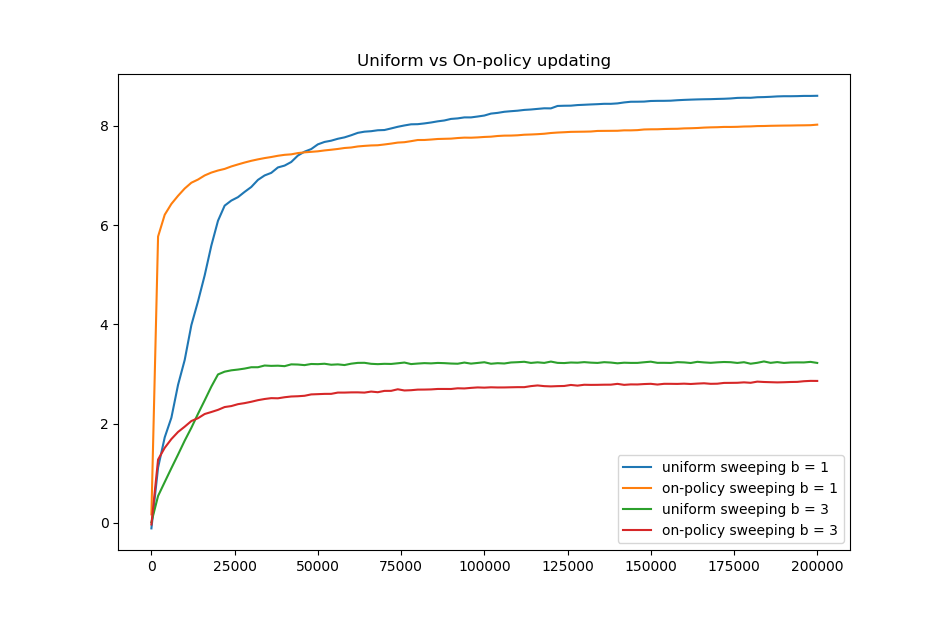

# Exercise 8.8: Comparison of Uniform vs On-Policy Sampling

	This experiment compares the performance of uniform sampling and trajectory sampling. In uniform sampling all state-action pairs are given equal attention, while in trajectory sampling only state-action pairs visited by the current policy are updated, repeatedly updating some pairs while others are completely ignored. To compare the two methods we use a simple environment with randomly generated transitions and rewards sampled from a gaussian distribution. In each state the agent can take one of two actions, after which the agent can be transferred to one of b different states with equal probability. 

	The two methods are compared by plotting the average value of the greedy policy as a function of the number of computational steps that that policy took to create. To calculate the value of the start state under the greedy policy we have several options. One is to use dynamic programming to solve the value of all states under the greedy policy, but this is computationally intensive and wasteful since we only need the value of one state. The second and possibly most optimal option is to calculate the expected value of the start state recursively using the Bellman equations. This was implemented in the “get_expected_value” function. While there is no discount factor, each transition has a ten percent chance of being terminal, so the value of the next state is effectively discounted by 0.9. Since there is never a guaranteed transition to a terminal state, an episode can technically go on forever. This means that the value can only be calculated to a certain amount of precision, determined by the depth with which you search. A search depth will calculate 1 - 0.9^d of the value of the original state, making even relatively small values of d fine for the purpose of benchmarking. This method works great for a deterministic environment with a branching factor of 1, but for any b > 1 the runtime explodes and it becomes an infeasible calculation. In these cases returns from the start state can instead be estimated by gathering sample returns and averaging them. Values calculated this way have much more variance, so it was only used when necessary (for any b > 1). Final results are pictured below:

	Interestingly, final results from this experiment deviated in exact values from the results in the book. A branching factor of b = 1 achieved a max start state value of about 8 in this implementation, while in the book it did not go much higher than 3. Additionally in this implementation the uniform sweeping passes on-policy far earlier than it seems to in the book’s graph. The simplest explanation is an error in the code, but that seems highly unlikely as at least two other re-implementations have achieved nearly identical results to mine [here](https://github.com/ShangtongZhang/reinforcement-learning-an-introduction/blob/master/images/figure_8_8.png) and [here](https://github.com/LyWangPX/Reinforcement-Learning-2nd-Edition-by-Sutton-Exercise-Solutions/blob/master/Chapter%208/ex8_8.png). Regardless, the overall shape and results are the same as in the book, so the details of the exact values are insignificant to the overall discussion.

	In all cases on-policy sampling outperformed uniform sampling at the beginning and then fell behind for the remainder of the experiment. The case of 10000 states with b = 3 asked about in exercise 8.8 does not seem to be any different, once again showing early advantages to on-policy updates but long term underperformance. There are a lot of parallels between uniform vs on-policy updating and exploration vs exploitation actions. Uniform updating can be thought of as exploring the state space for the best option, while on-policy sampling is exploiting the part of the state space the agent knows is decent. In a similar way that exploration finds better actions to exploit, uniform sampling finds states far from the current greedy policy that are actually better than those in the greedy policy. In most use cases it is most likely the case that an updating strategy somewhere between uniform and on-policy would probably be the best for overall performance, just like a mix of exploration and exploitation is needed in order to find the best policy.
